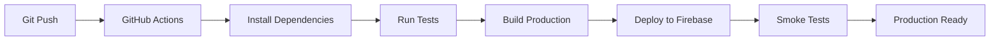

# Architecture Overview

## System Architecture

Curiosity PWA follows a modern, scalable architecture designed for performance, security, and maintainability.

### High-Level Architecture

```
┌─────────────────┐    ┌─────────────────┐    ┌─────────────────┐
│   Frontend      │    │   Firebase      │    │   Cloud         │
│   (React PWA)   │◄──►│   Functions     │◄──►│   Functions     │
│                 │    │                 │    │                 │
│ • React 18      │    │ • WebAuthn Auth  │    │ • Data Processing│
│ • Vite          │    │ • Business Logic │    │ • Scheduled Jobs │
│ • TailwindCSS   │    │ • API Endpoints  │    │                 │
│ • Service Worker│    │                 │    └─────────────────┘
└─────────────────┘    └─────────────────┘             ▲
         │                       │                    │
         ▼                       ▼                    │
┌─────────────────┐    ┌─────────────────┐             │
│   IndexedDB     │    │   Firestore     │◄────────────┘
│   (Offline)     │    │   (Primary DB)  │
│                 │    │                 │
│ • Local Cache   │    │ • User Data     │
│ • Drafts        │    │ • Settings      │
│ • Offline Queue │    │ • Sync State    │
└─────────────────┘    └─────────────────┘
```

## Frontend Architecture

### Component Structure

```
src/
├── components/           # UI Components
│   ├── common/          # Reusable components
│   ├── views/           # Page-level components
│   ├── forms/           # Form components
│   └── layout/          # Layout components
├── contexts/            # React Context providers
│   ├── StateProvider.jsx # Global state management
│   └── ThemeProvider.jsx # Theme management
├── hooks/               # Custom React hooks
├── utils/               # Utility functions
├── constants.js         # App constants
└── firebaseConfig.js    # Firebase configuration
```

### State Management

Curiosity uses a hybrid state management approach:

#### Global State (Context API)
- **StateProvider**: Manages app-wide state including:
  - Current user and authentication
  - App settings and preferences
  - Current view/route
  - Loading states
  - Error handling

#### Local State (useState/useReducer)
- Component-specific state
- Form state management
- UI interaction states

#### Server State (React Query/SWR)
- API data fetching and caching
- Real-time data synchronization
- Offline data management

### Data Flow

```
User Action → Component → Context Action → State Update → UI Re-render
                                      ↓
                               Firebase API Call → Data Sync
                                      ↓
                               IndexedDB Cache Update
```

## Backend Architecture

### Firebase Services

#### Cloud Functions
- **WebAuthn Authentication**: Handles biometric registration and verification
- **Data Processing**: Server-side data validation and processing
- **Scheduled Tasks**: Reminder notifications and maintenance jobs

#### Firestore Database Schema

```javascript
// Users Collection
{
  userId: {
    username: "string",
    email: "string",
    profilePicUrl: "string",
    settings: {
      theme: "light|dark|auto",
      fontSize: "small|medium|large",
      // ... other settings
    },
    webAuthnChallenge: "string", // Temporary challenge for WebAuthn
    createdAt: Timestamp,
    updatedAt: Timestamp
  }
}

// Entries Collection
{
  userId: {
    entryId: {
      title: "string",
      content: "string", // Markdown content
      type: "journal|note|task",
      tags: ["array", "of", "tags"],
      createdAt: Timestamp,
      updatedAt: Timestamp,
      isDeleted: false
    }
  }
}

// Goals Collection
{
  userId: {
    goalId: {
      title: "string",
      description: "string",
      status: "pending|in-progress|completed",
      createdAt: Timestamp,
      updatedAt: Timestamp
    }
  }
}

// Tasks Collection
{
  userId: {
    taskId: {
      goalId: "string",
      text: "string",
      completed: false,
      createdAt: Timestamp,
      updatedAt: Timestamp
    }
  }
}

// Vault Items Collection (Encrypted)
{
  userId: {
    itemId: {
      title: "string",
      type: "password|contact|note",
      encryptedData: "string", // Base64 encoded encrypted data
      createdAt: Timestamp
    }
  }
}

// WebAuthn Credentials Collection
{
  userId: {
    credentialId: {
      id: "string", // Base64 encoded credential ID
      credentialPublicKey: "string", // Base64 encoded public key
      counter: number,
      credentialDeviceType: "string",
      transports: ["array", "of", "transports"],
      createdAt: Timestamp
    }
  }
}
```

### Security Architecture

#### Authentication Flow
1. **Firebase Auth**: Primary authentication via Google OAuth
2. **WebAuthn**: Biometric authentication for app unlock
3. **PIN Fallback**: Secure PIN for devices without biometrics

#### Data Encryption
- **Client-Side Encryption**: Sensitive vault data encrypted before storage
- **Key Management**: Encryption keys derived from user credentials
- **Secure Storage**: Encrypted data stored in Firestore

#### API Security
- **Firebase Security Rules**: Database access control
- **Function Authentication**: Cloud Functions require authenticated users
- **Input Validation**: Server-side validation of all inputs

## PWA Architecture

### Service Worker
```javascript
// Service Worker Responsibilities
- Static asset caching
- Runtime caching strategies
- Background sync for offline actions
- Push notification handling
- Cache management and cleanup
```

### Offline Strategy
- **Cache-First**: Static assets cached for offline use
- **Network-First**: Dynamic data fetched from network when available
- **Background Sync**: Offline actions queued and synced when online
- **IndexedDB**: Local data storage for offline functionality

### Performance Optimizations
- **Code Splitting**: Dynamic imports for route-based splitting
- **Asset Optimization**: Image optimization and compression
- **Bundle Analysis**: Webpack bundle analyzer for optimization
- **Lazy Loading**: Components loaded on demand

## Development Architecture

### Build System
- **Vite**: Fast development server and optimized production builds
- **ESBuild**: Lightning-fast JavaScript bundling
- **PostCSS**: CSS processing with TailwindCSS
- **Asset Handling**: Optimized image and font loading

### Testing Strategy
- **Unit Tests**: Component and utility function testing
- **Integration Tests**: API and component interaction testing
- **E2E Tests**: Full user journey testing with Playwright
- **Visual Regression**: Screenshot comparison for UI consistency

### Deployment Pipeline


## Monitoring & Analytics

### Error Tracking
- **Sentry**: Client-side error tracking and reporting
- **Firebase Crashlytics**: Mobile app crash reporting
- **Custom Logging**: Structured logging for debugging

### Performance Monitoring
- **Firebase Performance**: App performance metrics
- **Web Vitals**: Core Web Vitals tracking
- **Custom Metrics**: Business-specific performance tracking

### Analytics
- **Firebase Analytics**: User behavior and engagement tracking
- **Custom Events**: Feature-specific usage analytics
- **Privacy-First**: GDPR compliant data collection

## Scalability Considerations

### Database Scaling
- **Firestore Indexes**: Optimized queries with proper indexing
- **Data Partitioning**: User-based data isolation
- **Caching Strategy**: Multi-layer caching (CDN, browser, service worker)

### Function Scaling
- **Cold Starts**: Minimized through keep-alive strategies
- **Resource Allocation**: Appropriate memory and CPU allocation
- **Regional Deployment**: Functions deployed in user regions

### Frontend Scaling
- **Bundle Splitting**: Code splitting for optimal loading
- **Image Optimization**: Responsive images and lazy loading
- **CDN Distribution**: Global content delivery

## Future Architecture Evolution

### Planned Improvements
- **Microservices**: Break down monolithic functions into microservices
- **GraphQL API**: More flexible data fetching with GraphQL
- **Real-time Sync**: Enhanced real-time collaboration features
- **AI Integration**: ML-powered features for content analysis
- **Multi-tenant**: Support for teams and organizations

### Technology Migration Path
- **React 19**: Upgrade to latest React features
- **Firebase v10**: Latest Firebase SDK features
- **WebAssembly**: Performance-critical features in WebAssembly
- **Edge Computing**: Global edge deployment for better performance